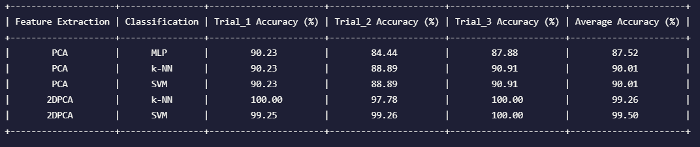

# Using 2DPCA and SVM for Face Recognition
**Assignment 2 - Programming Intergration Project for Artificial Intelligence**   
This method combines 2D Principal Component Analysis (2DPCA), one of the prominent methods for extracting feature vectors, and Support Vector Machine (SVM), the most powerful discriminative method for classification.  
The technique we use is based on the paper [1110.5404](https://arxiv.org/abs/1110.5404): Face Recognition Based on SVM and 2DPCA. 

<!-- <div align="center">

</div>  -->

## Authors 
**Quach Minh Tuan - Vo Van Tien Dung - Tran Ngoc Anh Quan - Hoang Vu**

## Getting Started

### Requirements
+ `Python` >= 3.9.7
+ `Pip` >= 21.2.3
+ `Tensorflow` >= 2.6.0


### Check out the code and install: 
```sh
git clone https://github.com/nh0znoisung/2DPCA_SVM_Face_Recognition
cd 2DPCA_SVM_Face_Recognition
python setup.py
```

### Install dependencies
<!-- conda create -n dict-guided -y python=3.7
conda activate dict-guided
conda install -y pytorch torchvision cudatoolkit=10.0 -c pytorch
# Install Detectron2
python -m pip install detectron2==0.2 -f \
  https://dl.fbaipublicfiles.com/detectron2/wheels/cu100/torch1.4/index.html -->
```sh
python -m pip install -r requirements.txt
```

### Run code
Using `Jupyter Notebook` and run all blocks in file `main.ipynb`.


## Dataset 
In this problem, we use [AT&T Database of Faces](https://www.kaggle.com/kasikrit/att-database-of-faces). In this database, there are ten different images of each of 40 distinct subjects. For some subjects, the images were taken at different times, varying the lighting, facial expressions (open / closed eyes, smiling / not smiling) and facial details (glasses / no glasses). All the images were taken against a dark homogeneous background with the subjects in an upright, frontal position (with tolerance for some side movement). A preview image of the Database of Faces is available.

The files are in PGM format, and can conveniently be viewed on UNIX (TM) systems using the 'xv' program. The size of each image is 92x112 pixels, with 256 grey levels per pixel. The images are organised in 40 directories (one for each subject), which have names of the form sX, where X indicates the subject number (between 1 and 40). In each of these directories, there are ten different images of that subject, which have names of the form Y.pgm, where Y is the image number for that subject (between 1 and 10).

##  Experiments on AT&T database
In this paper, we implement 5 methods including PCA + MLP(Multilayer Perceptron), PCA + k-NN(K-nearest neighbors), PCA + SVM(Support Vector Machine), 2D-PCA + k-NN and 2D-PCA + SVM.

For each method, we conducted three experimental trials on subsets A, B and C. Therefore, a subset must have 10 folders and each folder randomly contains 3 or 4 images. It means that we trained classifiers on the combine of two subsets and evaluated on the remaining subset. The results are reported on their average performance scores in the picture below.


## Evaluation
The experimental results point that this method for feature extraction is better than PCA and 2DPCA methods. As mentioned above, PCA is a method to reduce the
dimension. There is not any mathematical evidence that it will increase the recognition rate. This method has more advantages than traditional 2DPCA because it can create a subspace that reserves some importance discriminative information of face images such as pose.

The experimental results also show that MLP is the worst classification method and SVM
is the best one. Obviously, MLP is easy to be overfitting because they usually focus on
finding the lowest error rate although we use some techniques such as cross validation to limit the weak point. In other hand, SVM method always gives a suitable solution.
